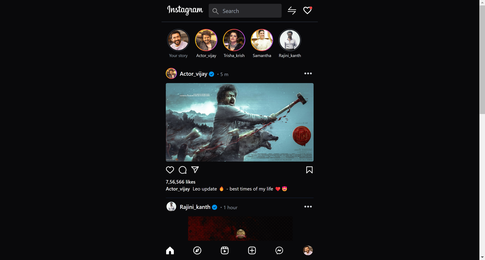

# Instagram UI Challenge Using Tailwind CSS

This project is an Instagram user interface (UI) challenge created using Tailwind CSS. It aims to replicate the appearance and functionality of the Instagram web application.



## Table of Contents

- [Demo](#demo)
- [Features](#features)
- [Technologies Used](#technologies-used)
- [Getting Started](#getting-started)
- [Usage](#usage)
- [Contributing](#contributing)
- [License](#license)

## Demo

You can interact with the live demo of this Instagram UI challenge [here](https://mageshvachiravel.github.io/Instagram-UI-tailwind/).

## Features

- Accurate recreation of the Instagram web application's user interface.
- Responsive design for various screen sizes.
- User profile view with posts, followers, and following counts.
- Emulation of key Instagram features such as liking and commenting on posts.
- Utilizes Tailwind CSS for efficient and maintainable styling.

## Technologies Used

- HTML5
- CSS3 (Tailwind CSS)

## Getting Started

To run this Instagram UI challenge on your local machine, follow these steps:

1. Clone this repository to your local machine:

   ```bash
   git clone https://github.com/MageshVachiravel/Instagram-UI-tailwind.git
